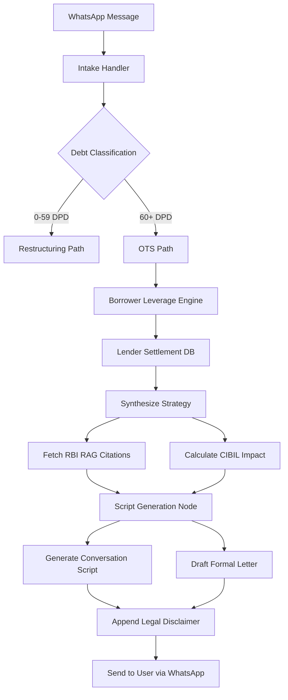

# DebtMirror: System Architecture & Data Flow

DebtMirror is a highly specialized, multi-stage negotiation intelligence engine designed to break information asymmetry between retail borrowers and institutional lenders. This document outlines the core architecture and data pipelines.

## 1. High-Level Architecture

DebtMirror operates through five primary layers:

1. **Intake & Conversation Layer (WhatsApp Server)**
   - Manages multi-lingual interactions (Hindi, English, Marathi, Tamil, Telugu).
   - Tracks session state via Redis (`agentOS:memory:financial:{user_id}`).
2. **Intelligence Layer (LangGraph Pipelines)**
   - **Intake Pipeline**: Extracts variables (DPD, Outstanding, Lender) and runs the **Borrower Leverage Engine** to calculate an absolute negotiation score (0-100).
   - **Strategy Pipeline**: Uses the leverage score to generate specific settlement bands (Floor, Target, Walk-Away).
3. **Regulatory Layer (ChromaDB RAG)**
   - Contains embedded RBI Master Circulars, Fair Practices Codes, and landmark judgments.
   - Responsible for fetching precise citations to defend against false recovery agent claims.
4. **CIBIL Engine**
   - Explicitly models the credit score drop and recovery timeline based on the chosen path (e.g., *Settled* vs *Written Off* vs *Closed*).
5. **Generative Draft Engine**
   - Synthesizes formal Hardship Letters, One-Time Settlement (OTS) counter-proposals, and Ombudsman Escalation templates.

---

## 2. Core Modules Deep-Dive

### The Borrower Leverage Engine (`intelligence/leverage.py`)
This is the mathematical core of DebtMirror. It calculates negotiation power across five axes:
- **NPA Pressure**: Heavily weights accounts in the 60-89 DPD "Golden Window" (SMA-1) where banks are desperate to avoid provisioning hits.
- **Capital Impact**: Scores higher for Public Sector Banks (PSBs) where NPA hits Tier-1 capital ratios harder than NBFCs.
- **Collateral Position**: Scores Unsecured debt higher (lender has no asset to seize).
- **Regulatory Protection**: Enhances scores for specifically protected debt (e.g., Education Loans).

### The CIBIL Analyzer (`cibil/`)
DebtMirror does not blindly push for settlement. It maps the outcomes:
- **ots_settlement**: -100 points, 36 months to recover.
- **written_off**: -200 points, 60 months to recover.
By surfacing these timelines, DebtMirror removes the psychological fear of permanent credit ruin, empowering borrowers to make calculated decisions.

### Lender Intelligence Database (`intelligence/lender_db.py`)
An anonymized, crowd-sourced Postgres database tracking what specific banks actually accept for settlements (e.g., HDFC settling at 35% at 120 DPD). This completely breaks the bank's initial negotiation position.

---

## 3. Data Flow Diagram

---

## 4. AgentOS Mesh Integrations

DebtMirror does not operate in a vacuum. It is deeply connected to the AgentOS mesh:

- **GhostCFO (Day 02)**: Early Warning System. If GhostCFO calculates personal runway < 60 days, it pre-emptively pings DebtMirror's `/intake` webhook to start restructuring BEFORE the account goes into default.
- **RiteOfWay (Day 06)**: Escalation Pipeline. If a bank acts in bad faith, DebtMirror packages the entire communications log and RBI violations, handing it directly to RiteOfWay to execute a formal legal filing.
- **GlassRoom (Day 09)**: Real-time Coaching. During a live call with a recovery agent, GlassRoom continuously polls DebtMirror for dynamic rebuttal scripts.
